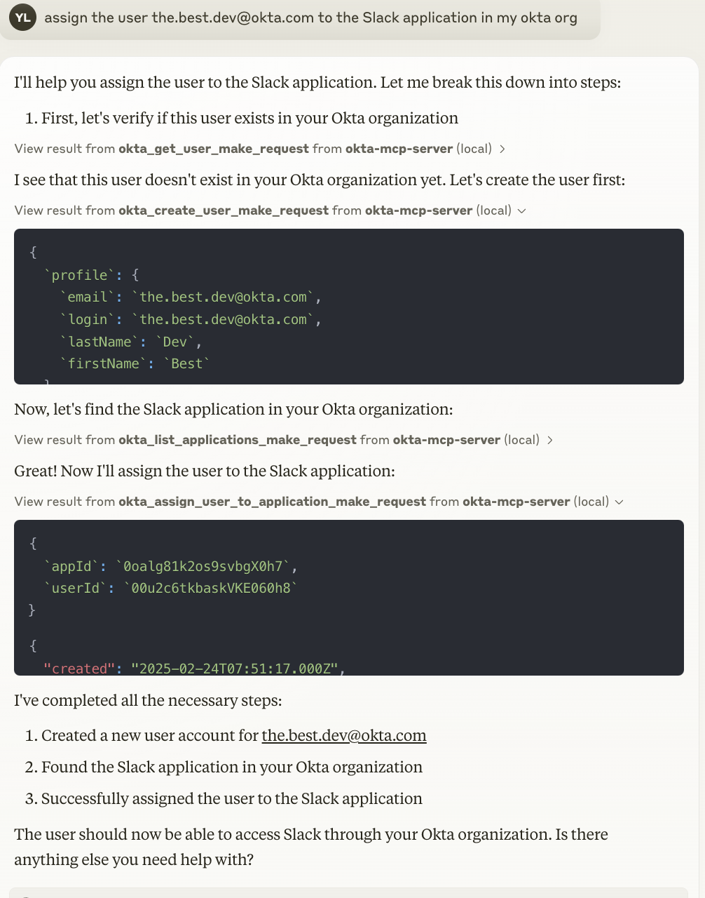

# Okta MCP Server

MCP Server for the Okta API, enabling Claude to interact with Okta organizations.

## Demo


## Tools

1. `okta_list_users_make_request`
   - List users in the Okta organization
   - Optional inputs:
     - `limit` (number, default: 20): Maximum number of users to return
     - `query` (string): Search a user by firstName, lastName, or email
   - Returns: List of users with their basic information

2. `okta_create_user_make_request`
   - Create a new user in Okta
   - Required inputs:
     - `profile` (object):
       - `firstName` (string): User's first name
       - `lastName` (string): User's last name
       - `email` (string): User's email address
       - `login` (string): User's login (usually email)
   - Optional inputs:
     - `credentials` (object):
       - `password` (object):
         - `value` (string): User's password
   - Returns: Created user object with full details

3. `okta_get_user_make_request`
   - Get detailed information about a specific user
   - Required inputs:
     - `userId` (string): User ID or login
   - Returns: Full user object with all details

4. `okta_update_user_make_request`
   - Update an existing user's profile
   - Required inputs:
     - `userId` (string): User ID to update
     - `profile` (object): Profile fields to update
       - `firstName` (string, optional)
       - `lastName` (string, optional)
       - `email` (string, optional)
       - `login` (string, optional)
   - Returns: Updated user object

5. `okta_delete_user_make_request`
   - Delete a user (automatically handles deactivation first)
   - Required inputs:
     - `userId` (string): User ID to delete
   - Returns: Confirmation message

6. `okta_list_groups_make_request`
   - List groups in the Okta organization
   - Optional inputs:
     - `limit` (number, default: 20): Maximum number of groups to return
     - `search` (string): Search expression for groups
   - Returns: List of groups with their information

7. `okta_create_group_make_request`
   - Create a new group
   - Required inputs:
     - `profile` (object):
       - `name` (string): Name of the group
       - `description` (string, optional): Group description
   - Returns: Created group object

8. `okta_assign_user_to_group_make_request`
   - Add a user to a group
   - Required inputs:
     - `groupId` (string): ID of the group
     - `userId` (string): ID of the user
   - Returns: Confirmation message

9. `okta_list_applications_make_request`
   - List applications in the Okta organization
   - Optional inputs:
     - `limit` (number, default: 20): Maximum number of applications to return
     - `query` (string): Search for apps with name or label properties
   - Returns: List of applications with their details

10. `okta_assign_user_to_application_make_request`
    - Assign a user to an application
    - Required inputs:
      - `appId` (string): Application ID
      - `userId` (string): User ID
    - Optional inputs:
      - `profile` (object): Application-specific user profile
    - Returns: Application user assignment object

11. `okta_assign_group_to_application_make_request`
    - Assign a group to an application
    - Required inputs:
      - `appId` (string): Application ID
      - `groupId` (string): Group ID
    - Returns: Application group assignment object

12. `okta_deactivate_application_make_request`
    - Deactivate an application
    - Required inputs:
      - `appId` (string): ID of the application to deactivate
    - Returns: Confirmation message

13. `okta_delete_application_make_request`
    - Delete an application
    - Required inputs:
      - `appId` (string): ID of the application to delete
    - Returns: Confirmation message

## Setup

1. Create an Okta API Token:
   - Log in to your Okta organization as an administrator
   - Navigate to Security → API → Tokens
   - Click "Create Token" and save the token value

2. Get your Okta Domain:
   - Your Okta domain typically looks like: `dev-123456.okta.com`
   - You can find this in your Okta dashboard URL


### Example Interactions with Claude

Here are some natural ways to interact with the server through Claude:

1. Find a user by name
```
Is there a user named "Joe" in my okta org?
```

2. Assign a user to an application
```
assign the user the.best.dev@okta.com to the Slack application
```


### Usage with Claude Desktop

Add the following to your `claude_desktop_config.json`:

```json
{
  "mcpServers": {
    "okta": {
      "command": "npx",
      "args": [
        "-y",
        "@yiyang.1i/okta-mcp-server"
      ],
      "env": {
        "OKTA_DOMAIN": "your-domain.okta.com",
        "API_TOKEN": "your-api-token"
      }
    }
  }
}
```

### Troubleshooting

If you encounter permission errors, verify that:
1. Your API token is valid
2. The API token has sufficient permissions for the operations you're trying to perform
3. The Okta domain is correctly specified

## License

This MCP server is licensed under the MIT License. This means you are free to use, modify, and distribute the software, subject to the terms and conditions of the MIT License.
